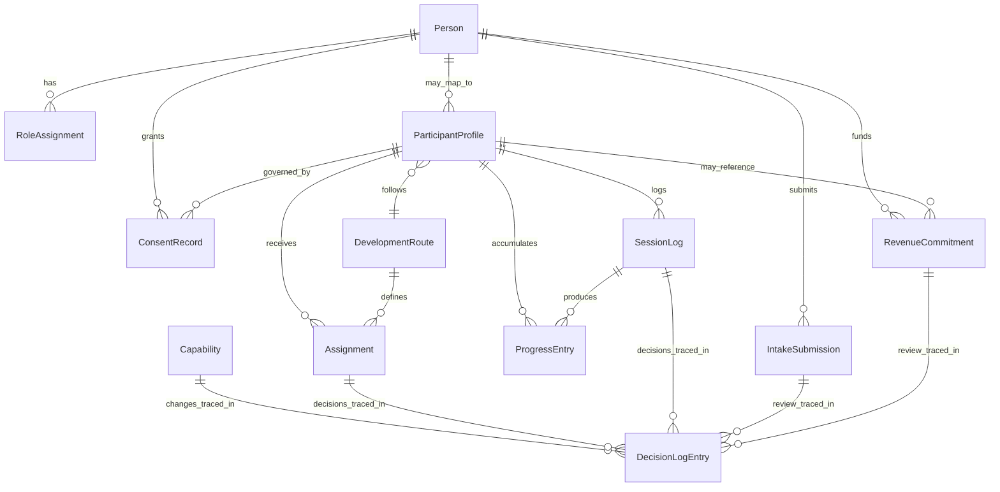

# PPBF Relationship Map (Reality Based)

Project: PPBF_BACKEND_READINESS_PROJECT
Mode: Architecture Only
Step: 3 (Relationship Map)
Date: 2026-07-13

## Preconditions

Step 1 is approved and locked:

- PPBF_CAPABILITY_MAP_REALITY_BASED.md
- PPBF_MISSING_CAPABILITY_REGISTER_REALITY_BASED.md
- PPBF_CAPABILITY_MAP_SELF_AUDIT.md
- PPBF_STEP1_APPROVAL_LOCK.md

Step 2 is active:

- PPBF_CORE_ENTITY_MAP_REALITY_BASED.md

## Guardrails

- No backend build
- No Dataverse table creation
- No SQL design implementation
- No API design implementation
- No persistence implementation
- No assumptions from roadmap-only capabilities

## Scope

This map defines entity relationships only for the Step 2 minimum set:

1. Person
2. RoleAssignment
3. ParticipantProfile
4. SessionLog
5. DevelopmentRoute
6. Assignment
7. ConsentRecord
8. ProgressEntry
9. DecisionLogEntry
10. Capability
11. IntakeSubmission
12. RevenueCommitment

## Relationship Certainty Levels

- CONFIRMED: directly evidenced by current typed code and active runtime behavior
- CANDIDATE: required by business flow, but currently represented as front-end or mock flow
- DEFERRED: relationship depends on missing/placeholder capabilities and is explicitly excluded from current canonical model

## Canonical Relationship Matrix

| From | To | Cardinality | Certainty | Reason |
|---|---|---|---|---|
| Person | RoleAssignment | 1:N | CONFIRMED | Required for role-scoped access and routing behavior |
| Person | ParticipantProfile | 1:0..N | CANDIDATE | Person can represent participant, coach, parent, board, admin |
| Person | ConsentRecord | 1:N | CONFIRMED | Consent is tied to a person/guardian participant context |
| Person | IntakeSubmission | 1:N | CANDIDATE | Public/admin intake originates from a person actor |
| Person | RevenueCommitment | 1:N | CANDIDATE | Sponsor/guardian/donor relationships require person anchor |
| ParticipantProfile | SessionLog | 1:N | CONFIRMED | Session logs are participant-scoped in execution model |
| ParticipantProfile | Assignment | 1:N | CONFIRMED | Assignments route to participant progression work |
| ParticipantProfile | ProgressEntry | 1:N | CONFIRMED | Progress entries track participant progression over time |
| ParticipantProfile | DevelopmentRoute | N:1 | CONFIRMED | Participant progression maps to a selected route |
| ParticipantProfile | ConsentRecord | 1:N | CONFIRMED | Participant-specific consent and permissions |
| ParticipantProfile | RevenueCommitment | 1:N | CANDIDATE | Scholarship/membership/funding commitments may reference participant |
| DevelopmentRoute | Assignment | 1:N | CONFIRMED | Route generates/contains assignment lanes |
| SessionLog | ProgressEntry | 1:0..N | CONFIRMED | Progress signals can be derived from logged sessions |
| SessionLog | DecisionLogEntry | 1:0..N | CANDIDATE | Governance/audit decisions can reference session events |
| Assignment | DecisionLogEntry | 1:0..N | CANDIDATE | Promotion/override/closure decisions require traceability |
| Capability | DecisionLogEntry | 1:0..N | CONFIRMED | Capability status/approval changes require governance trace |
| Capability | RoleAssignment | N:N | CANDIDATE | Capability access is role-scoped in admin governance flow |
| IntakeSubmission | DecisionLogEntry | 1:0..N | CANDIDATE | Intake review/promotion should be audit-traceable |
| RevenueCommitment | DecisionLogEntry | 1:0..N | CANDIDATE | Funding review/approval needs governance trace |

## Domain Views

### Program Execution View

- ParticipantProfile -> DevelopmentRoute -> Assignment
- ParticipantProfile -> SessionLog -> ProgressEntry
- ParticipantProfile -> ConsentRecord

### Governance And Traceability View

- Capability -> DecisionLogEntry
- Assignment -> DecisionLogEntry
- SessionLog -> DecisionLogEntry
- IntakeSubmission -> DecisionLogEntry
- RevenueCommitment -> DecisionLogEntry

### Intake And Funding View

- Person -> IntakeSubmission
- Person -> RevenueCommitment
- ParticipantProfile -> RevenueCommitment

## Relationship Exclusions (Step 1 Lock Alignment)

The following are explicitly excluded from current canonical relationship modeling:

- AI/ML Video Analysis relationships
- Video Review Intelligence relationships
- Performance Analytics Intelligence relationships
- Grant Compliance Intelligence relationships
- Automated Publication Workflow relationships
- Automated Compliance Monitoring relationships
- Closed-Loop Progression Intelligence relationships

Reason: these are missing or placeholder capabilities and remain roadmap/front-end visibility only.

## Minimal Logical Topology

## Step 4 Handoff Constraints

Before Dataverse Blueprint (Step 4):

1. Confirm all CANDIDATE relationships to promote versus defer.
2. Confirm whether Capability <-> RoleAssignment needs an explicit bridge entity.
3. Confirm whether RevenueCommitment is participant-only or multi-party (participant/guardian/sponsor).
4. Confirm whether IntakeSubmission requires subtype patterns (public intake vs admin intake).

## Approval Gate

This Step 3 relationship map is ready for review and Jason approval before Step 4 starts.
